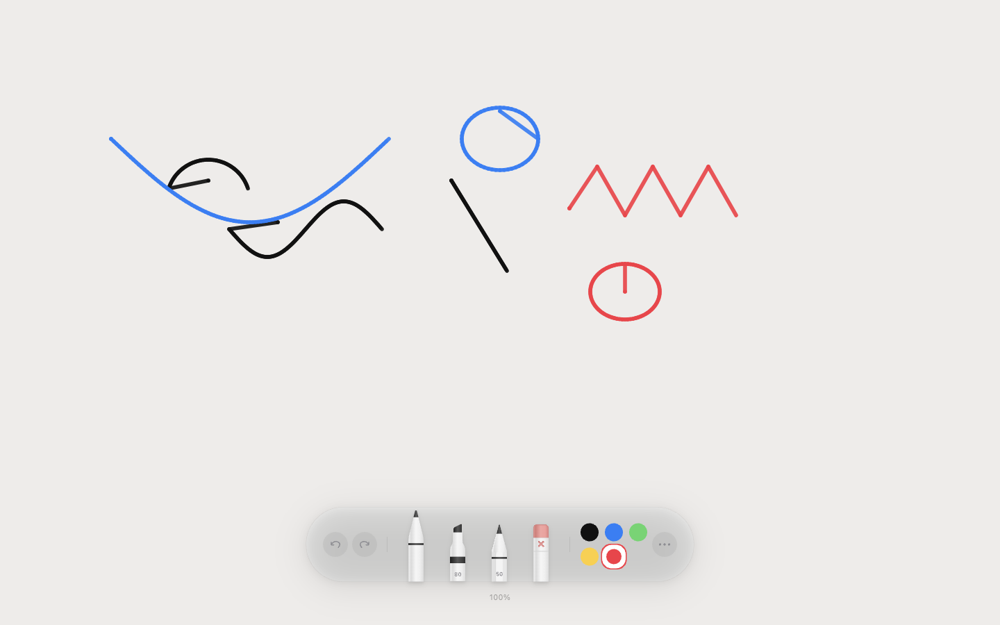
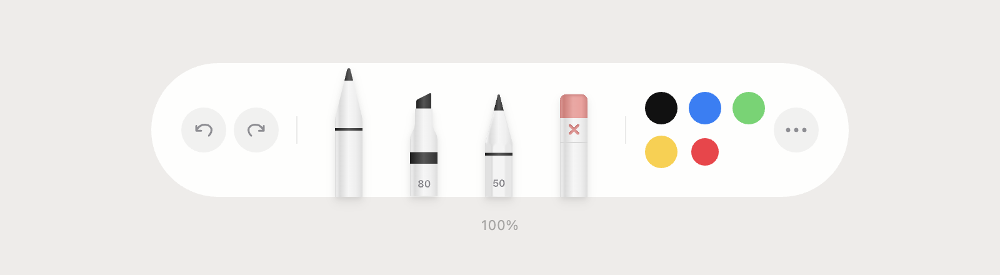
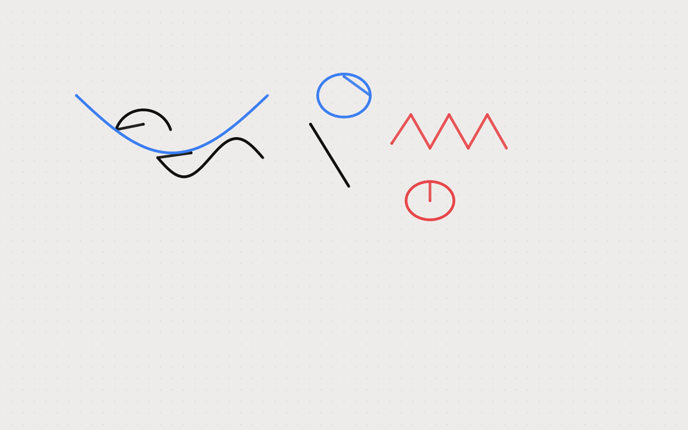

# Drawing Canvas UI

A lightweight, single-file drawing canvas with a physical instrument toolbar — inspired by iPadOS. No build step, no dependencies to install. Open the HTML file and draw.



---

## Toolbar



The floating pill toolbar sits at the bottom of the canvas and mirrors the Figma iPadOS / LightMode design. From left to right:

| Section | Controls |
|---|---|
| **History** | Undo (↺) and Redo (↻) buttons |
| **Tools** | Pen · Marker · Pencil · Eraser — rendered as physical Figma SVG instruments |
| **Palette** | 5 colour presets + a rainbow colour-wheel picker |
| **More (⋯)** | Export canvas as PNG |

---

## Drawing Tools



| Tool | Character |
|---|---|
| **Pen** | Thin, full-opacity line — precise freehand strokes |
| **Marker** | Wide, semi-transparent strokes that layer naturally |
| **Pencil** | Medium weight with a soft, natural feel |
| **Eraser** | Removes paint, reveals the paper background |

---

## Canvas Controls

| Action | How |
|---|---|
| **Undo** | `⌘Z` or the ↺ button |
| **Redo** | `⌘⇧Z` / `⌘Y` or the ↻ button |
| **Zoom** | Scroll wheel (zooms toward cursor) |
| **Pan** | Hold `Space` + drag |
| **Reset zoom** | Click the `100%` chip below the toolbar |
| **Export PNG** | Click `⋯` — composites paper background + drawing |

---

## Stack

- **React 18** — UMD build, no bundler needed
- **HTML5 Canvas API** — all drawing is pixel-level
- **Tailwind CSS** — CDN, utility classes for layout only
- **Babel Standalone** — in-browser JSX compilation
- **Single file** — everything lives in `canvas-ui.html`

---

## Run locally

```bash
python3 -m http.server 8080
```

Open `http://localhost:8080/canvas-ui.html` in your browser.

> **Tip:** Use a stylus or drawing tablet for the most natural feel. The canvas reads hardware pressure via the Pointer Events API when available.
